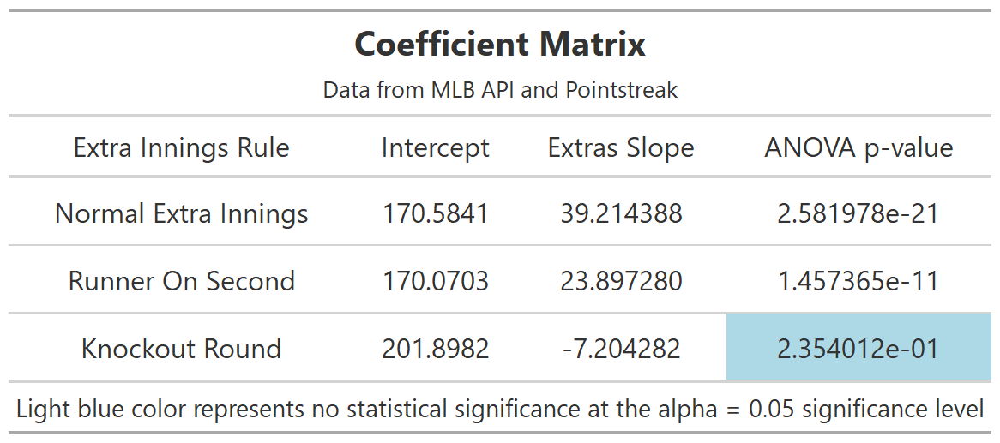
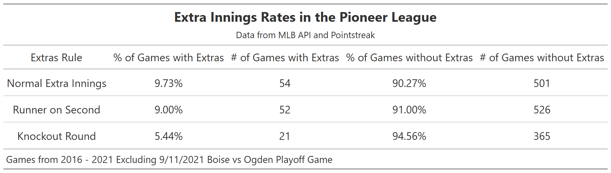
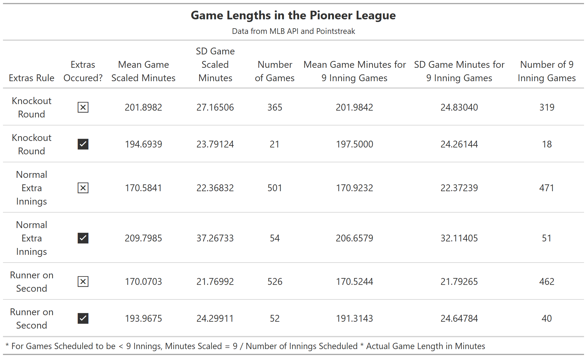

```{r setup, include=FALSE}
knitr::opts_chunk$set(echo = FALSE,
                      warning = FALSE,
                      message = FALSE)

library(ggplot2)
library(cowplot)
library(gridExtra)
```

## Abstract

  In recent years, Major League Baseball has tried furiously to reduce the length of game as well as cut costs of operation. They began doing reducing game length in the 2018 by implementing a rule where a runner starts on second base during extra innings in all levels of Minor League Baseball. This rule was deemed a success and then implemented in MLB games. Then, for the 2021 season, Major League Baseball contracted many Minor League Baseball teams around the country to cut costs of player salaries. Many of these communities that lost their affiliated team established summer collegiate baseball teams or joined already established independent leagues such as the Atlantic League. In the Rocky Mountain Region of the US, a whole league was disbanded. Those teams decided to rebrand their formerly affiliated league as an unaffiliated league under the same name: the Pioneer Baseball League.

  Following Major League Baseball, the Pioneer Baseball League announced that they also would be changing the rules for extra innings for the 2021 season. Instead of traditional baseball extra innings, the league opted for a “Knockout Round” where each team would send a player to compete in a sudden death homerun derby to end the game in a similar fashion to a soccer or hockey game end in penalty kicks. This proposes a unique question of which form of tiebreaker (normal extra innings, extra innings starting with a runner on second, and this “knockout round”) leads to a quicker conclusion of the game after a regulation 9 innings was played. Using box score data from the Pioneer Baseball League, this paper models the total amount of game time of games that went into extra innings compared to game time of games that did not go into extra innings, broken up by the current rule for extra innings.
  
\newpage

## Relevant History of the Pioneer Baseball League

The current Pioneer Baseball League (PBL) was founded in 1939 in the Rocky Mountain region of the country. In 1964, the PBL became associated with Rookie Level Minor League Baseball (MiLB), where it remained for the rest of its affiliated years. Throughout the years, the league has had many different teams from several Rocky Mountain states, but primarily has been maintained teams in Montana, Idaho, Colorado and Utah.

Minor League Baseball as a whole has been a training ground for future Major League Baseball (MLB) players, umpires and rules for many decades and the PBL is no exception. Major League Baseball announced that they would be experimenting with a new rule for Extra Innings in all levels of MiLB beginning in 2018. Per the new rule, the batter in position prior to the leadoff batter for the inning will start any extra inning as a runner on second base. The goal driving this change is to reduce the length of time games that go into extra innings take. By starting with a runner on second, there is a much higher chance that a run will be scored than without the runner. This rule was later successfully implemented in MLB, but was and currently still in heavily criticized.

During the 2019 season, Major League Baseball (MLB) announced the contraction of around 40 Minor League Teams beginning in the 2021 teams. These contractions would be based on a variety of factors including facilities. Given that Rookie Level Baseball was at the time the lowest level of affiliated baseball, the facilities at many if not all PBL stadiums were not up to standard by the time the first cut list was announced by MLB in December 2020. Of course, due to the COVID-19 Pandemic, there was no MiLB season for those teams to have any money to afford stadium renovations at that time. Thus when the official list of teams to be contracted came out, every team in the PBL was released from unaffiliated baseball. Rather than allow empty stadiums in their cities, the teams of formerly affiliated Pioneer Baseball League came together and were joined by the Boise Hawks previously of the Northwest League to form a new independent league under the previous name.

Being free from MLB rule, league operators decided to change the extra inning rules even more than starting a runner on second base. They adopted what they called a "Knockout Round". In a similar manner to penalty kicks in soccer, each team would send one batter to the plate after the conclusion of the 9th inning to participate in a competition to hit the most home runs on 5 swings as they can. If there was a tie after 5 swings, then the process would repeat for 5 more swings until a winner was decided. This rule was not in place for the playoffs and instead, normal extra innings (without a runner starting on second base) were implemented.

With complaints occurring every day about the length of baseball games getting out of control, the Pioneer Baseball League provides the unique opportunity to directly compare and contrast 3 different styles of extra innings and their direct relation to the game time.

\newpage

## Defining Terminology

The three styles of extra innings are as follows:

The **"Normal Extra Innings Rule"** occurred where innings after regulation are played just as they were during regulation. This occurred every year prior to the 2018 Season. For our data, this is the 2016 and 2017 seasons

The **"Runner on Second Rule"**  occurred where innings after regulation are started with the batter prior to the lead-off batter for the upcoming inning on second base. This rule took place during the 2018 and 2019 Seasons.

The **"Knockout Round Rule"**  occurred when the score is tied after the number of scheduled innings. The Knockout round consists of both teams selecting a batter from their team to participate in a Homerun Derby Style Competition. Each player will be given 5 swings and the number of homeruns will be tallied. The team of the player hits the most number of homeruns in those 5 swings will be declared the winner of the game. In case of a tie after 5 swings, this process of 5 swings will repeat until a winner is decided. This rule took place during the 2021 Season.

**"Scaled Minutes"** is defined as $\frac{9}{SI} * Min$ where $SI$ is the number of innings scheduled to be played and $Min$ is the actual game time in minutes that the game took. There were several occasions in multiple seasons where 7 inning games were scheduled as double headers due to rain outs. This data is still useful, but we needed to put it on a proper scale of 9 innings.

## Data

The data comes from 2 different sources. Prior to 2020, the Pioneer Baseball League was affiliated with Major League Baseball. By adapting code from the baseballr package created by Bill Petti, I was able to pull this historical data from the MLB API. I did so for the years 2016-2019. During the years 2016 and 2017, the extra innings rule for the PBL was the "Normal Extra Innings Rule". Through the MLB API, I was also able to extract data from the 2018 and 2019 seasons. During these two seasons, the PBL operated under the "Runner on Second Rule" for extra innings.

For the 2021 season, the Pioneer Baseball League was an independent league and their data was not available in the MLB API. The provider that the league used was pointstreak.com. On the Pointstreak website, I was able to find text files containing extended box scores for all games during the regular season and the playoffs. I webscraped this data into R to use in my analysis.

One data point from the 2021 Season was excluded from the analysis. On September 11, 2021, the Boise Hawks played the Ogden Raptors in the Pioneer Baseball League playoffs. The game went to extra innings which were competed according to the "Normal Extra Innings Rule" unlike during the Regular Season where the "Knockout Round" was in place. The league announced this change for the playoffs before the season started hence why this occurred. All other games from the 2016, 2017, 2018, 2019, and 2021 season were used.

\newpage

## Exploratory Data Analysis

The approach taken in this project to evaluate which extra inning rule is the most efficient in ending the game is to compare the length of games for that season that did not go to extra innings to ones that did. 

```{r Graphics1, fig.show = "hold", out.width = "75%", fig.align='center'}
ggdraw() + draw_image("Plots/Extra Inning Rules Distribution All Games.png")
```

The figure above is an exploratory data analysis plot simply showing a density of game time in scaled minutes for non extra inning games standardized to 9 innings and for real game time for games that went to extra innings. One particularly interesting finding that is very noticeable in this graph is that the median game time for games standardized to 9 innings is much higher when the Knockout Round is in effect. This could be due to a variety of reasons to be explained later. The main takeaway from this plot is that there appears to be significant shifts in game time when the Runner on Second and Normal Extra Innings Rules were in effect. However, when the Knockout Round rule is in effect, that appears not to be the case.

```{r Graphics2, fig.show = "hold",  fig.align='center'}
p1 <- ggdraw() + draw_image("Plots/Normal Extra Innings All Games.png")
p2 <- ggdraw() + draw_image("Plots/Runner on Second All Games.png")
p3 <- ggdraw() + draw_image("Plots/Knockout Round All Games.png")
p4 <- ggdraw() + draw_image("Plots/Violin Faceted by Rule.jpg")
plot_grid(p4, p1, p2, p3,
          align = "hv",
          nrow = 2)
```

Another way at looking at these differences is with the above violin plot. The crossbar represents the median game length in scaled minutes. This further solidifies the prior thoughts that we had from the previous graphic about the significant time differences between games that needed extra innings in contrast to the games that did not. From this graph, we also notice long tails for games that ended in regulation skewed towards longer game times. These are mostly from games where either one or both teams scored a lot of runs.

The other 3 graphs are density curves that show the differences in the distributions where the extra inning rules came into effect or not. For the Normal Extra Inning Rule and the Runner on Second Rule, the purple curve, representing where extra inning rules did not come into effect, is clearly skewed further left than the green curve,  representing where extra inning rules did come into effect. This is as expected, because games that go to extra innings involve more baseball being played and should take longer. However, for the Knockout Round graph in the bottom right, these curves greatly overlap forming the grey color. This will be discussed in the following section.

\newpage

## Methodology

To analyze this problem, 3 first order linear models were created with the response variable being scaled game time in minutes, one for each different extra inning rule. The game time was scaled using the formula = $min^*= min * 9 / n$ where $n$ is the number of scheduled innings in the game. Scaling the minutes this way gave us the opportunity to include double header games, primarily for the 2021 season, that were make up games for previous dates that had been rained out. These double headers were typically scheduled for 7 innings in length. The intercept and slope coefficients are displayed in the table below for each different extra inning rule.



After fitting models for each extra inning rule, the Analysis of Variance procedure was performed on each model to determine the significance of each slope coefficient. For the Normal Extra Innings and the Runner on Second rules, the p-value calculated is less than the alpha significance level of $\alpha = 0.05$ which means that there is a statistically significant difference in game time caused by extra innings. 

However, for the games where the Knockout Round was the rule for extra innings, the p-value when testing the null hypothesis $\beta_1 = 0$ is .235, which is not significant at an alpha significance level of $\alpha = 0.05$. This means that having extra innings did not have much of an effect on the length of the game as a whole.

Although this sounds like it may not be important, the insignificance of the slope coefficient for the Knockout Round model is actually highly important. Because there is not a statistically significant difference in game time, this means there is no difference in game time between games that did not got to extra innings and those that used the Knockout Round when that rule was in effect. This implies that the Knockout Round is the most efficient form of extra innings out of the rules presented in regards to trying to reduce the total game length. Unfortunately, there are other factors such as small sample size that may have influence over these findings as we will discuss in the following section.

\newpage

## Project Shortcomings

This project has a few problems that ended up playing a huge role when it came time for analysis. The most relevant issue is the difference in play between Independent Leagues and Rookie Leagues. This caused a variety of issues including sample size problem for games under the Knockout Round Extra Inning Rule.

After becoming an independent league, the Pioneer Baseball League expanded their schedule to include more games. The Normal Extra Innings Extras Rule contains data from the 2016 and 2017 seasons. The Runner on Second Extras Rule contains data from the 2018 and 2019 seasons. Even though the 2021 season is longer than past seasons, it is not as long as 2 previous seasons, which explains part of the difference in sample sizes.



Referencing the chart above, a very important factor to notice is that games were only about half as likely to occur under the Knockout Round. This caused an already limited number of games where the Knockout Round extra inning rule was in place to become even more limited. There is no explanation why this may be the place besides perhaps the difference in skill levels of players between affiliated and unaffiliated baseball.



Another very important difference between games where the Knockout Round was in place versus the other two extra inning rules is the average length of games with out extra innings. These are represented in the above table in rows with a black x surrounded in a white box with black border. For the seasons where the Normal Extra Innings and the Runner on Second Rule was in effect, the average game length where extra innings did not occur was around 170 minutes. In contrast, during the 2021 season when the Knockout Round extra inning rule was in effect the average game time was 31 minutes higher. The PBL has come out and stated that this is partially due to poor pitching. This is also visible by looking at the graph on page 4.

\newpage

## Sources

Bill Petti (2021). baseballr: Functions for acquiring and
  analyzing baseball data. R package version 0.8.5.
  https://billpetti.github.io/baseballr/

Daniels, Tim. “Minor League Baseball to Put Runners on 2nd Base to Start Extra Innings.”
*Bleacher Report*, Bleacher Report, 14 Mar. 2018, https://bleacherreport.com/articles/2764408-minor-league-baseball-to-put-runners-on-2nd-base-to-start-extra-innings.

“League History.” MiLB.com, Minor League Baseball, https://www.milb.com/pioneer/history.

“On Pointstreak Sports Technologies.” Pointstreak Sports Technologies, https://pointstreak.com/.

“Pioneer League Installs New Rules for 2021.” MiLB.com, Minor League Baseball, 27 Apr. 2021, https://www.milb.com/pioneer/news/pioneer-league-installs-new-rules-for-2021.

Rachac, Greg. “Independent Pioneer League Managed Challenges in 2021, Eyes Improvement, Expansion.” 406 MT SPORTS, 406mtsports.Com, 22 Sept. 2021, https://406mtsports.com/baseball/pioneer-league/independent-pioneer-league-managed-challenges-in-2021-eyes-improvement-in-future/article_73c904e3-8c80-502d-82ef-ee93c265e334.html.
